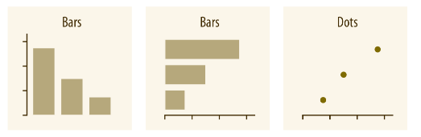
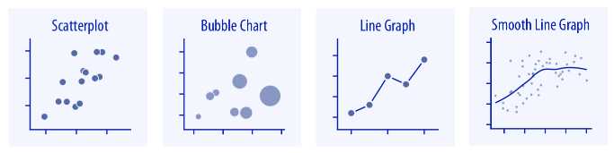

```{r setup, include=FALSE}
knitr::opts_chunk$set(
  echo = TRUE,
  collapse = TRUE,
  comment = "#>",
  message = FALSE,
  warning = FALSE,
  class.source = "custom-chunk-background"
  )
```


> **Supplementary resources:**
>
> - [ggplot2: elegant graphics for data analysis](https://ggplot2-book.org) From Hadley Wickham, Danielle Navarro, and Thomas Lin Pedersen.
> - [Data Visualization - A practical introduction](http://socviz.co/) from Kieran Healey.
> - [Fundamentals of Data Visualization](https://serialmentor.com/dataviz/) by Claus O. Wilke
> - [R Graphics Cookbook](https://r-graphics.org/) by Winston Chang
> - [ggplot2 cheat sheet](https://raw.githubusercontent.com/rstudio/cheatsheets/master/data-visualization-2.1.pdf)
> - [list of ggplot2 extensions](https://www.ggplot2-exts.org/)
> - [The R Graph Gallery](https://www.r-graph-gallery.com/)


Let's load our packages.
```{r message=FALSE, warning=FALSE}
# loading and shaping data
library(readr)
library(dplyr)
library(haven)
library(broom)

# data sources
library(gapminder)
library(palmerpenguins)

# general data visualisation
library(ggplot2)
library(ggridges)
library(ggthemes)
library(gghighlight)
library(ggforce)
library(patchwork)

# for the maps shapefiles
library(eurostat)
library(maps)
library(sf)
```


Let's also load our data that we'll be using this session. (don't worry about the message about the duplicated column names for now)

```{r warning=FALSE, message=FALSE}
# data
penguins_df <- palmerpenguins::penguins

gapminder_df <- gapminder

ess_hun <- read_csv("data/ESS_Hun_7.csv")

stocks <- read_csv("data/stocks.csv")
```

# The logic of a ggplot2 plot
To kick start this session, let's review how a plot is made and extend our knowledge on how to fine tune elements of the plot. This section was inspired by the [presentation of Eva Maerey](https://evamaerey.github.io/ggplot_flipbook/ggplot_flipbook_xaringan.html#1) We will use the **Palmerson Penguins dataset**, that contains data for `r nrow(penguins_df)`  penguins. There are `r length(unique(penguins_df$species))` different species of penguins in this dataset, collected from 3 islands in the Palmer Archipelago, Antarctica. The original publication of this data is in [Gorman, Williams & Fraser (2014)](https://journals.plos.org/plosone/article?id=10.1371/journal.pone.0090081).


```{r out.width = "350px", echo=FALSE, fig.align='center', fig.cap='Artwork by @allison_horst'}

knitr::include_graphics("figures/02_penguins.png")

```  


Now let's build a `ggplot2` plot from the grounds up!

## 1 {-}

First, we **specify the data** we want to use within our `ggplot()` function call with the `data = ` argument. 
```{r}
ggplot(data = penguins_df)
```


## 2 {-}

Second, we **decide on the dimensions of our data**. Let's start by specifying what to plot on the y and x axes. This is done within the `aes()` argument, which stands for 'aesthetic'.
```{r}
ggplot(data = penguins_df,
       mapping = aes(x = body_mass_g,
                     y = flipper_length_mm))
  
```


## 3 {-}

Third, we **add our wanted representation** of the data, with the `geom_` function family. 
```{r}
ggplot(data = penguins_df,
       mapping = aes(x = body_mass_g,
                     y = flipper_length_mm)) +
  geom_point()
```


## 4 {-}

Fourth, we can **add further dimension** to our plot by extending the `aes()` arguments. Let's add colors based on the species variable.
```{r}
ggplot(data = penguins_df,
       mapping = aes(x = body_mass_g,
                     y = flipper_length_mm,
                     color = species)) +
  geom_point()
```

## 5 {-}

Fifth, each **aesthetic can be rescaled**. Now we want to rescale our colors. We will use the manual color scale to specify each value. Colors can be added as HEX code, or names.
```{r}
ggplot(data = penguins_df,
       mapping = aes(x = body_mass_g,
                     y = flipper_length_mm,
                     color = species)) +
  geom_point() +
  scale_color_manual(values = c("#7fc97f", "blue", "#fdc086"))
```


## 6 {-}

Sixth, we can modify the **textual elements** of our plot. To do this, we can assign a string to every text element with the `labs` function. As we see the color aesthetic created automatically a legend on the side. We can remove the title of it should we want it.
```{r}
ggplot(data = penguins_df,
       mapping = aes(x = body_mass_g,
                     y = flipper_length_mm,
                     color = species)) +
  geom_point() +
  scale_color_manual(values = c("#7fc97f", "blue", "#fdc086")) +
  labs(
    title = "Penguins, their mass and their flippers",
    subtitle = "The positive relationship between body mass and flipper size",
    caption = "Data: Gorman, Williams & Fraser (2014)",
    x = "Body mass (g)",
    y = "Flipper length (mm)",
    color = ""
    )

```


## 7 {-}

Finally, we decide on the **theme** of our hearts. `ggplot2` offers an ocean of customization options for our plot, there are some pre-made themes but we can create our own as well. Now we will stick to `theme_minimal()`.
```{r}
ggplot(data = penguins_df,
       mapping = aes(x = body_mass_g,
                     y = flipper_length_mm,
                     color = species)) +
  geom_point() +
  scale_color_manual(values = c("#7fc97f", "blue", "#fdc086")) +
 labs(
   title = "Penguins, their mass and their flippers",
   subtitle = "The positive relationship between body mass and flipper size",
   caption = "Data: Gorman, Williams & Fraser (2014)",
   x = "Body mass (g)",
   y = "Flipper length (mm)",
   color = ""
   ) +
  theme_minimal()
```


## 7+1 Export your plot {-}

For this, use the `ggsave()` function, where you can specify the resolution with `dpi` (no more low resolution exports!), and the dimensions of the exported plot and the file format as well. As a default it saves the last `ggplot` that you created, but you can always store your plot in an object and save a given plot explicitly. See the example below.

```{r eval=FALSE}

my_plot <- ggplot(data = penguins_df,
       mapping = aes(x = body_mass_g,
                     y = flipper_length_mm)) +
  geom_point()

ggsave(my_plot, filename = "my_plot.png", dpi = 320, width = 120, height = 120)

```

# Data visualization staples

In this section we will cover various key types of visualizations. The structure of this section follows the structure of Claus Wilke's great [Fundamentals of Data Visualization](https://clauswilke.com/dataviz/) book. Here we will cover the most often used type of plots, how to make them and how to address/avoid some of the typical issues.

## Amounts and proportions

```{r out.width = "550px", echo=FALSE, fig.align='center'}



```  
Source: [Fundamentals of Data Visualization, 5.1 ch](https://clauswilke.com/dataviz/directory-of-visualizations.html#amounts)


### Bars {-}

We can use the bar charts to visualize categorical data. Let's prep some data. We convert the character variables to factors, because this will let the `ggplot` function know the ordering of our categorical variables. If we want to order our variables according to a particular order, re-leveling the factors are the solution for that.

```{r}
ess_hun <- ess_hun %>% 
  mutate(
    gndr = factor(gndr, labels = c("Female", "Male")),
    polintr = factor(polintr, labels = c("Very interested", "Quite interested", "Hardly interested", "Not at all interested", "Refusal", "Don't know"), ordered  = TRUE)
  )

```


There are two ways to create a barcharts with `ggplot2`: `geom_bar()` and `geom_col()`. The difference between these two is well described by the `ggplot2` [documentation](https://ggplot2.tidyverse.org/reference/geom_bar.html): "`geom_bar()` makes the height of the bar proportional to the number of cases in each group (or if the weight aesthetic is supplied, the sum of the weights). If you want the heights of the bars to represent values in the data, use `geom_col()` instead. `geom_bar()` uses `stat_count()` by default: it counts the number of cases at each x position. `geom_col()` uses `stat_identity()`: it leaves the data as is."

We will be using `geom_bar()` for this section. Let's see the political interest of the Hungarian people.

```{r}
ggplot(ess_hun, aes(polintr)) +
  geom_bar()
```

We can use the `fill` option to map another variable onto our plot. Let's see how these categories are further divided by the gender of the respondents. By default we get a stacked bar chart.

```{r}
ggplot(ess_hun, aes(polintr, fill = gndr)) +
  geom_bar()
```

we can use the `position` function in the `geom_bar` to change this. Another neat trick to make our graph more readable is `coord_flip`.
```{r}
ggplot(ess_hun, aes(polintr, fill = gndr)) +
  geom_bar(position = "dodge") +
  coord_flip()
```

Let's make sure that the bars are proportional. For this we can use the `y = ..prop..` and `group = 1` arguments, so the y axis will be calculated as proportions. The `..prop..` is a temporary variable that has the `..` surrounding it so there is no collision with a variable named prop.

```{r}
ggplot(ess_hun, aes(polintr, fill = gndr)) +
  geom_bar(position = "dodge", aes(y = ..prop.., group = gndr)) +
  coord_flip()
```

Combining categorical data and continuous data and using `group by` is also doable. We just create a grouped data and have the needed variables computed, then plot it. For this example, we'll compute the average bill length for each penguin species in our sample and plot it with a barplot.

```{r}
penguins_sum <- penguins_df %>% 
    group_by(species) %>% 
    summarise(avg_bill_length = mean(bill_length_mm, na.rm = TRUE))

penguins_sum
```

We'll use this data for our plot. Note, that now we have both `x` and `y` aesthetic for the bar plot. To supress ggplot's automatic instinct to create a count variable we use the `stat = "identity"` option, so the `y` axis statistics is taken as-is from the data.

```{r}
ggplot(penguins_sum, aes(x = species, y = avg_bill_length)) +
  geom_bar(stat = "identity") +
  coord_flip()
```


### Dots {-}

Using dots can also be used instead of bars. First let's create a subset of the gapminder data for years 1987 and 2007, for the Asian continent. Then let's visualize life expectancy using dots instead of bars. 

```{r}
gapminder_americas <- gapminder_df %>% 
  filter(continent == "Americas", year %in% c(1987, 2007)) %>% 
  mutate(year = as.factor(year))

gapminder_americas

```


```{r}

ggplot(gapminder_americas, aes(lifeExp, reorder(country, lifeExp), color = year)) +
  geom_point()

```

To highlight the changes between '87 and '07 we can clear up the plot by connecting the dots with a line. Note that we now moved the color `aes()` to the `geom_point()` and used `group = country` for `geom_line`. The reason is that `geom_line()` shouldn't inherit colors from the years and needs a grouping variable to connect the correct data points. Also make sure that the `geom_point()` comes last as `ggplot` renders the geoms in their order of appearance.


```{r}

ggplot(gapminder_americas, aes(lifeExp, reorder(country, lifeExp))) +
  geom_line(aes(group = country)) +
  geom_point(aes(color = year)) +
  labs(
    x = "Life Expectancy",
    y = NULL,
    color = NULL
  ) +
  theme_minimal()

```


### Heatmaps {-}

The idea behind heatmaps is to map the values onto colors instead of bars or dots. For this we will use the `geom_tile` function. To have a manageable size we'll subset the gapminder dataframe for Asian countries and pipe that data right into the ggplot function. It is always good practice to have some logic guiding the order of the categorical variables apart from alphabetical order. For this plot we use the `reorder()` function to reorder the countries by their life expectancy. 

As an addition we also use `scale_fill_viridis_c()` for a nice color palette. (more on colors later)

```{r}
gapminder_df %>% 
  filter(continent == "Asia") %>% 
  ggplot(aes(year, reorder(country, lifeExp), fill = lifeExp)) +
  geom_tile() +
  scale_fill_viridis_c(direction = -1) +
  theme_minimal()
```


### Histogram {-}

Now let's introduce ourselves to the gapminder dataset and check some of the variables' distribution. The data is a panel dataset, so our observations are country-years.

```{r}
ggplot(gapminder_df, aes(x = lifeExp)) +
  geom_histogram() 
```


To add some flair to our figure, we use `color` and `fill` inside the `geom_` call. What is the difference between the two? Note that here we changed the `bindiwdth` parameter of the `geom_histogram` and the resolution of the histogram changed accordingly.

```{r}
ggplot(gapminder_df, aes(x = lifeExp)) +
  geom_histogram(binwidth = 1, color = "black", fill = "orange") # we can set the colors and border of the bars and set the binwidth or bins 
```

We can plot the distribution by continent as well, using the `fill` aesthetic option.

```{r}
ggplot(gapminder_df, aes(x = lifeExp, fill = continent)) +
  geom_histogram()
```


### Density plot {-}

A variation on histograms is called density plots that uses Kernel smoothing (fancy! but in reality is a smoothing function which uses the weighted averages of neighboring data points.)

```{r}
ggplot(penguins_df, aes(x = body_mass_g)) +
  geom_density()
```

Add some fill
```{r}
ggplot(penguins_df, aes(x = body_mass_g)) +
  geom_density(fill = "orange", alpha = 0.3)
```

Your intuition is correct, we can overlap multiple density plots. For this we will use the `fill` aesthetic and create a different fill for each penguin species. To have some visibility, we set the `alpha` level to a more transparent value.

```{r}
ggplot(penguins_df, aes(x = body_mass_g, fill = species)) +
  geom_density(alpha = 0.35, color = "white")

```


### Ridgeline {-}

This one is quite spectacular looking *and* informative. It has a similar function as the overlayed histograms but presents a much clearer data. For this, we need the `ggridges` package which is a `ggplot2` extension. They are most useful when we have to visualize distributions over times (or a large amount of distributions). For this we will use the `airquality` dataset, which is a built in example dataset.

```{r}
airquality_df <- airquality %>% 
  mutate(
    temp_c = (Temp - 30) / 2,
    month = factor(Month, ordered = TRUE)
    )
  

head(airquality_df)
```


```{r}
ggplot(airquality_df, aes(x = temp_c, y = month, fill = month)) +
  geom_density_ridges(scale = 0.8, alpha = 0.5)
```
My all time favorite example for a ridge plot is probably the fun survey on [Perceptions of probability](https://github.com/zonination/perceptions).

###  Box plot {-}

The box plot is a good way to visualize distributions in your data, although it can be a but misleading. Interpretation of the box plot is that the following. The box contains 50% of the values, the whiskers are the minimum and maximum values without the outlines, the line inside the box is the median. The upper and lower edges of the box are the first and third quartiles, respectively.

In visual form:

```{r, out.width = "700px", echo=FALSE}
knitr::include_graphics("figures/EDA-boxplot.png")
```

*Source: [Wickham, Hadley, and Garrett Grolemund. R for data science: import, tidy, transform, visualize, and model data. " O'Reilly Media, Inc.", 2016.](http://r4ds.had.co.nz/exploratory-data-analysis.html)*

```{r}
ggplot(penguins_df, aes(x = species, y = body_mass_g)) +
  geom_boxplot()

```


To add some visual flair, we can color the outlier points and also show the actual datapoints by also plotting `geom_jitter`.

```{r}

ggplot(penguins_df, aes(x = species, y = body_mass_g)) +
  geom_boxplot(outlier.color = "orange") + 
  geom_jitter(alpha = 0.25)
```


## x ~ y relationships

So far we were mainly visualizing descriptive statistical properties, now it is time to check for some association within our datasets. 

```{r out.width = "550px", echo=FALSE, fig.align='center'}



``` 
Source: [Fundamentals of Data Visualization, 5.1 ch](https://clauswilke.com/dataviz/directory-of-visualizations.html#xy-relationships)

### Scatterplot {-}

We use scatter plot to illustrate some association between two continuous variable. Usually, the `y` axis is our dependent variable (the variable which is explained) and `x` is the independent variable, which we suspect that drives the association. 

Now, we want to know what is the association between the GDP per capita and life expectancy.

```{r}
ggplot(gapminder_df, aes(gdpPercap, lifeExp)) +
  geom_point()
```

What are the problems with this plot?

Now that we have a basic figure, let's make it better and deal with some of the issues. We transform the x axis values with the `scale_x_log10()` and add text to our plot with the `labs()` function. Within `geom_point()` we can also specify geom specific options, such as the alpha level (transparency). This way we address the issue of overplotting as well as the log transformation creates a "more normal" distribution.

```{r}
ggplot(gapminder_df, aes(gdpPercap, lifeExp)) +
    geom_point(alpha = 0.25) +
    scale_x_log10() +
    labs(
      x = "GDP per capita", 
      y = "Life expectancy",
      title = "Connection between GDP and Life expectancy",
      subtitle = "Points are country-years",
      caption = "Source: Gapminder"
      )
```


To add some analytical power to our plot we can use `geom_smooth()` and choose a `method` for it's smoothing function. It can be `lm`, `glm`, `gam`, `loess`, and `rlm`. We will use the linear model ("lm"). *Note: this is purely for illustrative purposes, as our data points are country-years, so "lm" is not a proper way to fit a regression line to this data.* This example also shows how to plot two geoms into one figure.


```{r}
ggplot(gapminder_df, aes(gdpPercap, lifeExp)) +
    geom_point(alpha = 0.25) + 
    geom_smooth(method = "lm", se = TRUE, color = "orange") +
    scale_x_log10() +
    labs(
      x = "GDP per capita", 
      y = "Life expectancy",
      title = "Connection between GDP and Life expectancy",
      subtitle = "Points are country-years",
      caption = "Source: Gapminder"
    )


```

what if we want to see how each continent fares in this relationship? We need to include a new argument in the mapping function: `color = `. Now it is clear that European countries (country-years) are clustered in the high-GDP/high life longevity upper right corner.

```{r}
ggplot(gapminder_df, aes(gdpPercap, lifeExp, color = continent)) +
    geom_point(alpha = 0.5) + 
    geom_smooth(method = "lm", se = TRUE, color = "black") +
    scale_x_log10() +
    labs(
      x = "GDP per capita", 
      y = "Life expectancy",
      title = "Connection between GDP and Life expectancy",
      subtitle = "Points are country-years",
      caption = "Source: Gapminder"
    )
    
```


We add horizontal line or vertical line to our plot, if we have a particular cutoff that we want to show. We can add these with the `geom_hline()` and `geom_vline()` functions. In the below example we'll draw horizontal and vertical lines at the median and average of the x and y axis. Similarly to the geoms introduced so far, we can change the type of these lines, with the `linetype` option. It can be “blank”, “solid”, “dashed”, “dotted”, “dotdash”, “longdash”, “twodash”.

```{r}
ggplot(gapminder_df, aes(gdpPercap, lifeExp, color = continent)) +
  geom_point(alpha = 0.5) + 
  geom_vline(xintercept = mean(gapminder_df$gdpPercap), linetype = "dashed") +
  geom_hline(yintercept = median(gapminder_df$lifeExp), linetype = "dotted") +
  scale_x_log10() +
  labs(
    x = "GDP per capita", 
    y = "Life expectancy",
    title = "Connection between GDP and Life expectancy",
    subtitle = "Points are country-years",
    caption = "Source: Gapminder"
  )

```


### Bubble chart {-}

To replicate the famous gapminder bubble chart we will encode a third dimension alongside our life expectancy and GDP percapita variables. This is going to be the size of the country. In order to have a manageable plot we will use the 2002 cross section. Using size we can embed a new dimension, however we should be mindful not to overburden the audience with information.

We can control the maximum size of the bubbles with `scale_size_area`

```{r}
gapminder_df %>% 
  filter(year == 2002) %>% 
  ggplot(aes(gdpPercap, lifeExp, size = pop, color = continent)) +
  geom_point(alpha = 0.8) +
  scale_size_area(max_size = 15) +
  scale_x_log10()
```

### Line graphs {-}

For this we use data on stock closing prices. As we are now familiar with the ggplot2 syntax, I do not write out all the `data = ` and `mapping = `. Note that here we have to use the group argument to group our data according to companies. 

```{r}
ggplot(stocks, aes(date, stock_index, group = company)) +
  geom_line()
```

Add some refinements. One way to highlight our focus (let's say $AMZN stocks) is to use the `gghighlight` package which provides this useful extension.


```{r}
ggplot(stocks, aes(date, stock_index, group = company)) +
  geom_line() +
  gghighlight(
    company == "AMZN.Close", 
    use_direct_label = TRUE, 
    label_params = list(size = 3)
    ) +
  labs(
    x = "", 
    y = "Index, 2006/01/11 = 100",
    title = "Closing daily prices for selected tech stocks",
    subtitle = "Data from 2016-01-10 to 2018-01-10",
    caption = "source: Yahoo Finance"
    )
```


Faceting (or creating small multiples) is an excellent way to declutter our plot. To drop the legend from the side, we'll drop the guide from the `scale_color_discrete` function using the `guide = FALSE` option. To highlight the trend in our stock data, we can color the area under the curves as well, with the `geom_area`.

```{r}
ggplot(stocks, aes(date, stock_index, color = company)) +
  geom_line() +
  geom_area(aes(fill = company), alpha = 0.6) +
  scale_color_discrete(guide = FALSE) +
  scale_fill_discrete(guide = FALSE) +
  labs(
    x = "", 
    y = "Index, 2006/01/11 = 100",
    title = "Closing daily prices for selected tech stocks",
    subtitle = "Data from 2016-01-10 to 2018-01-10",
    caption = "source: Yahoo Finance"
    ) +
    facet_wrap(~company, nrow = 4)
```


## Regression model output

Out of the example data that we have had, let's try to model the life expectancy in certain countries from the `gapminder` dataset as a function of the GDP per capita, population and spatial features (continent). We will fit a linear model and estimate it with OLS.

```{r}
gapminder_cs <- gapminder %>% 
    filter(year == 2007)


glimpse(gapminder_cs)

```

In R a linear model can be fitted with the `lm()` function, which has the same familiar arguments as the previous functions we have looked at in this section. We need to specify a formula with the response variable on the right hand side and the explanatory variables on the left hand side. And we need to tell the function the name of the data object.

```{r}
reg1 <- lm(lifeExp ~ gdpPercap + pop + continent, data = gapminder_cs)

summary(reg1)
```


## Regression and the `broom` package

Let's dig into our regression objects. We'll stick to the `reg1` object for now. 

To make the somewhat messy regression output more "tidy", we'll use the `broom` package's `broom::tidy()` function. It creates a data frame from our regression object with the estimate, se, f statistics and p.value columns, and each IV as row.

```{r}
reg1_tidy <- tidy(reg1, conf.int = TRUE)

reg1_tidy
```

To get more information into our data frame, use the `broom::augment()` function, will add the fitted values, residuals as well.

```{r}
reg1_aug <- augment(reg1)

head(reg1_aug, 10)
```

If we need the model diagnostics, use the `broom::glance()` function.

```{r}
glance(reg1)
```

As we now have our regression output in a tidy format we can turn to `ggplot2` to exploit its tools and visualize. First, we can plot the fitted values and residuals to check for heteroskedasticity.

```{r}
ggplot(data = reg1_aug,
       mapping = aes(x = .fitted,
                     y = .resid)) +
    geom_point()
```

Or create a coefficient plot. (Don't forget to add the `conf.int` parameter as `TRUE` to the `tidy()` call.) For `geom_errorbar` the `width` argument controls the size of the whiskers, for the `geom_errorbarh`, it is the `height =`. For added guidance to our audience, let's create a significance dummy variable and sort our plot according to effect size.

```{r}
reg1_tidy

reg1_tidy %>% 
  mutate(significant = ifelse(p.value < 0.05, "yes", "no")) %>%
  filter(term != "(Intercept)") %>% 
  ggplot(aes(reorder(term, estimate), estimate, color = significant)) +
  geom_point() +
  geom_errorbar(aes(ymin = conf.low, ymax = conf.high, width = 0.1)) +
  scale_color_manual(values = c("grey", "black"), guide = FALSE) +
  coord_flip()
```


# Themes and plot elements

By now we are all familiar with `ggplot2` and how to create all sorts of visualizations. Now it's time we get the details right. `ggplot2` offers great flexibility and there are many extension packages to help with some more niche functionality.

## Themes
In this section we will go over some of the elements that you can modify in order to get an informative and nice looking figure. `ggplot2` comes with a number of themes. You can play around the themes that come with `ggplot2` and you can also take a look at the `ggthemes` package, where I included the economist theme. Another notable theme collection is the `hrbthemes` package. The BBC also published their R package which they use to create their graphics. You can find it on GitHub here: [https://github.com/bbc/bbplot](https://github.com/bbc/bbplot)

```{r, echo=FALSE, warning=FALSE}
penguins_small <- sample_frac(penguins_df, size = 0.4)

p1 <- ggplot(data = penguins_small,
       aes(x = body_mass_g,
           y = flipper_length_mm)) +
    labs(title = "ggplot default") +
    geom_point()

p2 <- ggplot(data = penguins_small,
       aes(x = body_mass_g,
           y = flipper_length_mm)) +
    geom_point() +
    labs(title = "theme_bw") +
    theme_bw()

p3 <-ggplot(data = penguins_small,
       aes(x = body_mass_g,
           y = flipper_length_mm)) +
    geom_point() +
    labs(title = "theme_minimal") +
    theme_minimal()

p4 <- ggplot(data = penguins_small,
       aes(x = body_mass_g,
           y = flipper_length_mm)) +
    geom_point() +
    labs(title = "theme_fivethirtyeight") +
    theme_fivethirtyeight()

gridExtra::grid.arrange(p1, p2, p3, p4, nrow = 2, ncol = 2)
```

Try out a couple to see what they differ in! The `ggthemes` package has a nice collection of themes to use. The theme presets can be used with the `theme_*()` function.

One of my personal favorite is the `theme_minimal()`
```{r}
ggplot(gapminder_df, aes(x = gdpPercap, y = lifeExp)) +
  geom_point(alpha = 0.25) + 
  scale_x_log10() + 
  theme_minimal() # adding our chosen theme
```


## Plot elements

Of course we can set all elements to suit our need, without using someone else's theme.
<br>
<br>

```{r out.width = "700px", echo=FALSE, fig.align='center', fig.cap="Source: ggplot2 Theme Elements Demonstration (https://henrywang.nl/ggplot2-theme-elements-demonstration/)"}

knitr::include_graphics("figures/theme_elements.png")

```

The key plot elements that we will look at are:  

* labels
* grid lines
* fonts
* colors
* legend
* axis breaks

Adding labels, title, as we did before. For this example we will use the same plot that we created at the beggining of the session.

```{r}
ggplot(penguins_df, aes(x = body_mass_g, y = flipper_length_mm, color = species)) +
  geom_point()
```

Let's use a different color scale! We can use a color brewer scale (widely used for data visualization). To check the various palettes, see [http://colorbrewer2.org](http://colorbrewer2.org) The `scale_color_brewer()` creates direct access to the `colorbrewer2` palettes so we don't need to copypaste everything from the site. 

```{r}
ggplot(penguins_df, aes(x = body_mass_g, y = flipper_length_mm, color = species)) +
  geom_point() +
  scale_color_brewer(name = "Species", palette = "Set2") # adding the color brewer color scale

```

Or we can define our own colors with `scale_color_manual()`:

```{r}

ggplot(penguins_df, aes(x = body_mass_g, y = flipper_length_mm, color = species)) +
  geom_point() +
  scale_color_manual(values=c("coral3", "deepskyblue3", "orange")) # adding our manual color scale
```

To make each species more distinct we can use different shapes as well (called redundant coding).

```{r}

ggplot(penguins_df, aes(x = body_mass_g, y = flipper_length_mm, color = species, shape = species)) +
  geom_point()
```


To give a brief glimpse how customizable a ggplot2 figure is, we are going to modify some theme elements and change the look of our plot drastically to the better.

To clean up clutter, we will remove the background, and only leave some of the grid behind:
- We can hide the tickmarks with modifying the `theme()` function, and setting the `axis.ticks` to `element_blank()`. 
- Hiding gridlines also requires some digging in the `theme()` function with the `panel.grid.minor` or .major functions. 
- If you want to remove a gridline on a certain axis, you can specify `panel.grid.major.x`. We can also set the background to nothing. 
- We can modify the gridline within the `element_line()` function.
- As a final touch, the axis line is also recolored

```{r}
ggplot(penguins_df, aes(x = body_mass_g, y = flipper_length_mm, color = species, shape = species)) +
  geom_point() +
  theme(
    axis.ticks = element_blank(), # removing axis ticks
    panel.grid.major = element_line(color = "grey", size = 0.1, linetype = "dotted"), # recoloring the panel grids
    panel.background = element_blank(), # removing the background
    axis.line = element_line(colour = "grey")
    ) 
```


Finally, let's move the legend around. Or just remove it with `theme(legend.position="none")`. We also do not need the background of the legend, so remove it with `legend.key`, and play around with the text elements of the plot with `text`.

```{r}

ggplot(penguins_df, aes(x = body_mass_g, y = flipper_length_mm, color = species, shape = species)) +
  geom_point() +
  theme(
    axis.ticks = element_blank(), # removing axis ticks
    panel.grid.major = element_line(color = "grey", size = 0.1, linetype = "dotted"), # recoloring the panel grids
    panel.background = element_blank(),
    axis.line = element_line(colour = "grey"),
    legend.title = element_text(size = 12), # setting the legends text size
    text = element_text(face = "plain", family = "sans"), # setting global text options for our plot
    legend.key=element_blank(),
    legend.position = "bottom"
    )
```

In the final version, we add a custom color palette, the labels and all the modification we made so far.

```{r}
ggplot(penguins_df, aes(x = body_mass_g, y = flipper_length_mm, color = species, shape = species)) +
  geom_point() +
  labs(
    title = "Penguins, their mass and their flippers",
    subtitle = "The positive relationship between body mass and flipper size",
    caption = "Data: Gorman, Williams & Fraser (2014)",
    x = "Body mass (g)",
    y = "Flipper length (mm)",
    color = ""
    ) +
  scale_color_brewer(name = "Species", palette = "Set2") +
  scale_shape(guide = FALSE) +
  theme(
    axis.ticks = element_blank(), # removing axis ticks
    panel.grid.major = element_line(color = "grey", size = 0.1, linetype = "dotted"), # recoloring the panel grids
    panel.background = element_blank(),
    axis.line = element_line(colour = "grey"),
    legend.title = element_text(size = 12), # setting the legends text size
    text = element_text(face = "plain", family = "sans"), # setting global text options for our plot
    legend.key=element_blank(),
    legend.position = "bottom"
    )
  
```


While we are at it, we want to have labels for our data. For this, we'll create a plot which can exploit this. Let's return to the gapminder data for this exercise. To have a manageable sized number of observations we are going to filter the data somewhat.

What we use is the `geom_text` to have out labels in the chart. 

```{r}
gapminder_small <- gapminder_df %>% 
  filter(
    lifeExp >= 72.5, 
    gdpPercap >= 10000, 
    continent == "Europe", 
    year == 2002
    )

ggplot(gapminder_small, aes(lifeExp, gdpPercap, label = country)) + # we add the labels!
  geom_point() +
  geom_text()
```


To avoid overlapping text, use the `ggrepel` package which provides this functionality via the `ggrepel::geom_text_repel` and the `ggrepel::geom_label_repel` functions.

```{r}
ggplot(gapminder_small, aes(lifeExp, gdpPercap, label = country)) + 
  geom_point() +
  ggrepel::geom_text_repel()

```


notice the different outcome of `geom_label` instead of `geom_text`.

```{r}
ggplot(gapminder_small, aes(lifeExp, gdpPercap, label = country)) + # we add the labels!
  geom_point() +
  geom_label() # and use the geom label
```

If we want to label a specific set of countries we can do it from inside ggplot, without needing to touch our data. 

```{r}
ggplot(gapminder_df, aes(gdpPercap, lifeExp, label = country)) + # we add the labels!
  geom_point(alpha = 0.25) +
  geom_text(aes(label = if_else(gdpPercap > 60000, country, NULL))) # we add a conditional within the geom. Note the nudge_x!
```


## Creating a custom theme

Creating a custom theme function is probably the most accessible way to extend ggplot. The easiest way to start out is to use an existing theme and start from there. We'll going to be using the `theme_minimal` as a baseline and add a couple of things that we also modified in the previous session. We'll name it `theme_dotted`. The new theme is essentially a new function that wraps the original theme and modifies certain elemets with the use of the `%+replace%` operator.

```{r}
theme_dotted <- function() {
    theme_minimal() %+replace%
        theme(
            panel.grid.major.y = element_line(color = "grey", size = 0.1, linetype = "dotted"),
            panel.background = element_blank(),
            axis.line = element_line(colour = "grey"),
            legend.title = element_text(size = 12), 
            text = element_text(face = "plain", family = "sans"), 
            legend.key=element_blank()
        )
}
```

Now let's use it with our penguins data.

```{r}
penguins_df <- penguins

ggplot(penguins_df, aes(x = body_mass_g, y = flipper_length_mm, color = species)) +
    geom_point() +
    theme_dotted()
```

## Arranging plots

The easiest way to arrange multiple plost is to use the `pathwork` package. The syntax is really straighforward as it uses a simple notation with `+`, or `/` and `|` to arrange our plots. Let's create three plots, two sina charts, and one scatterplot.

```{r}
p_scatter <- ggplot(penguins_df, aes(x = body_mass_g, y = flipper_length_mm, color = species)) +
    geom_point() +
    theme_dotted()

p_sina1 <- ggplot(penguins_df, aes(x = species, y = body_mass_g)) +
    geom_sina(aes(color = species), alpha = 0.2) + 
    geom_violin(alpha = 0.25, fill = "grey") +
    theme_dotted() +
    theme(legend.position = "none")

p_sina2 <- ggplot(penguins_df, aes(x = species, y = flipper_length_mm)) +
    geom_sina(aes(color = species), alpha = 0.2) + 
    geom_violin(alpha = 0.25, fill = "grey") +
    theme_dotted() +
    theme(legend.position = "none")
```

After we are done with our plots, lets arrange the scatterplot on the top and the two sina plots on the bottom next to each other.

```{r}
p_scatter / (p_sina1 | p_sina2)
```

The `patchwork` package is very flexible, and the documentation is great so if you need to create these type of figures where you need to add together multiple plots check out its webpage: <https://patchwork.data-imaginist.com/index.html>


# Maps

(If we still have time)

Two essential parts of creating a map with `ggplot2`: - shapefile which draws the map - some data that we want to plot over the map

Getting the map data from the `maps` package

```{r}
world <- map_data("world")
```

We can plot the empty map

```{r}
ggplot(data = world,
       mapping = aes(x = long, y = lat, group = group)) +
  geom_polygon(fill = "white", color = "black") +
  coord_cartesian()
```

We can also subset the map data, just as we can with any other R object

```{r}
# subsetting the world data
world_subset <- world[world$region == "France",]

ggplot(data = world_subset,
       mapping = aes(x = long, y = lat, group = group)) +
  geom_polygon(fill = "white", color = "black") +
  coord_cartesian()
```

We can add data to our map. We subset our gapminder data for the year 1977. Then add a new row that matches the region variable in the map data so we can merge the two dataset. (we also get rid of Antarctica, because of aesthetics)

```{r}
year_2000 <- gapminder %>% 
  filter(year == 1977) %>% 
  mutate(country = as.character(country))

# adding key variable for merge
year_2000$region <- year_2000$country

# merging the data and the map and getting rid of antarctica
world_data <- left_join(world, year_2000, by = "region") %>% 
  filter(region != "Antarctica")
```

And now we can plot the map and data with the `geom_polygon()` and `coord_quickmap()`. I also made some modifications to the theme, so it looks better.

```{r}
ggplot(world_data, aes(long, lat, group = group, fill = lifeExp)) +
  geom_polygon(color = "gray90", size = 0.05 ) +
  coord_quickmap() +
  labs(
    fill = "Life expectancy",
    title = "Life expectancy around the world",
    subtitle = "1977",
    caption = "Data: Gapminder"
    ) +
  scale_fill_viridis_c(na.value = "white", direction = -1) +
  theme_bw() +
  theme(
    axis.line=element_blank(),
    axis.text=element_blank(),
    axis.ticks=element_blank(),
    axis.title=element_blank(),
    panel.background=element_blank(),
    panel.border=element_blank(),
    panel.grid=element_blank(),
    panel.spacing=unit(0, "lines"),
    plot.background=element_blank(),
    legend.justification = c(0,0),
    legend.position = c(0,0)
    )

```